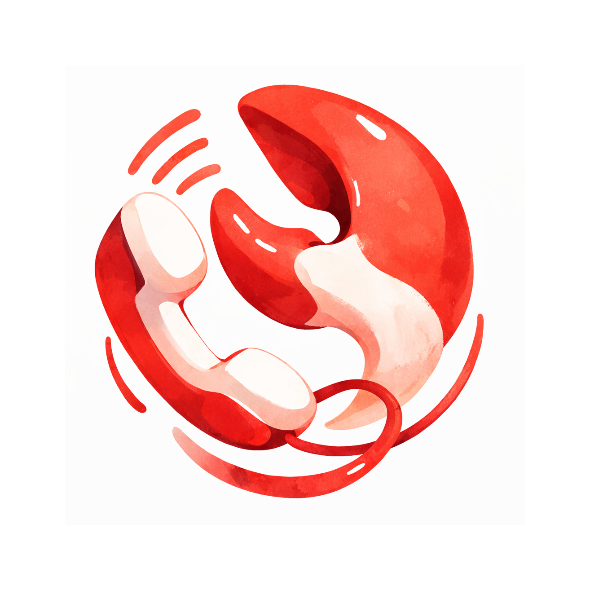

# CallingClaw — AI That Joins Your Meetings

<p align="center">
  
</p>

> An AI agent that joins Google Meet as a real participant — with memory, vision, and hands. It listens, speaks, presents, scrolls, clicks, and takes action.


**v2.9.0** · [www.callingclaw.com](https://www.callingclaw.com) · [Changelog](CHANGELOG.md) · [Team Intro Deck](https://callingclaw-team-intro.vercel.app/)

Multi-provider voice AI (OpenAI Realtime 1.5, Gemini 3.1 Live, Grok) with a dual-brain architecture: fast voice model for real-time conversation + slow reasoning model for deep research. Page Agent DOM extraction for screen understanding. Claude Code Channels for Telegram dispatch.

---

## What CallingClaw Does

| Capability | Description | Required Key |
|-----------|-------------|-------------|
| **Real-time Voice** | Bidirectional voice at ~300ms. 4 providers: OpenAI Realtime 1.5 (default), Gemini 3.1 Live, Grok, OpenAI legacy | Voice API Key |
| **Meeting Join** | Joins Google Meet via Playwright audio injection (no virtual drivers) | Google OAuth |
| **Screen Sharing** | Shares CallingClaw's screen in Meet, presents pages with scroll/click | Google OAuth |
| **Page Understanding** | DOM extraction (Page Agent style) + Gemini Flash vision. Reads pages as text, not screenshots | OpenRouter API Key |
| **Computer Control** | 4-layer automation: shortcuts → OpenCLI → Playwright → Computer Use. W3C synthetic click events | OpenRouter API Key |
| **Meeting Prep** | Auto-generates prep brief with speaking plan + scenes for presentations | OpenClaw or Claude Code |
| **Meeting Notes** | Real-time transcript, auto-extracted action items, branded HTML summary | OpenAI API Key |
| **Calendar** | View schedule, create meetings, auto-join 2min before start | Google OAuth |
| **Meeting Stage** | Transparent dual-panel workspace: S1 voice feed + S2 agent actions + presentation iframe | — |
| **Telegram Dispatch** | Claude Code Channels integration: receive commands, send summaries via Telegram | Claude subscription |

---

## Architecture

```
┌────────────────────────────────────────────────────────────────┐
│  Telegram / Claude Code Channels (optional dispatch layer)     │
│  User sends message → Claude Code → /callingclaw skill → REST │
└────────────────────────────┬───────────────────────────────────┘
                             │
┌────────────────────────────┼───────────────────────────────────┐
│                    CallingClaw Backend (Bun :4000)              │
│                                                                │
│  ┌─ System 1 (Fast Brain) ─────────────────────────────────┐   │
│  │ VoiceModule         → OpenAI Realtime 1.5 / Gemini Live │   │
│  │ TranscriptAuditor   → Haiku intent classification       │   │
│  │ ContextRetriever    → Haiku gap detection + file search  │   │
│  │ VisionModule        → Gemini Flash (screenshot analysis) │   │
│  └─────────────────────────────────────────────────────────┘   │
│                                                                │
│  ┌─ Automation Router (4 layers) ──────────────────────────┐   │
│  │ L1: Shortcuts (keyboard, app launch)        <100ms      │   │
│  │ L2: OpenCLI (66+ web adapters, Haiku)       1-2s        │   │
│  │ L3: Playwright (DOM snapshot + Haiku)        2-5s       │   │
│  │ L4: Computer Use (vision fallback)           5-10s      │   │
│  └─────────────────────────────────────────────────────────┘   │
│                                                                │
│  ┌─ System 2 (Slow Brain) ─────────────────────────────────┐   │
│  │ AgentAdapter        → OpenClaw / Claude Code / Standalone│   │
│  │ MeetingPrepSkill    → Deep research + speaking plan      │   │
│  │ PostMeetingDelivery → Summary + action items to Telegram │   │
│  └─────────────────────────────────────────────────────────┘   │
│                                                                │
│  ┌─ Chrome (Playwright) ───────────────────────────────────┐   │
│  │ Tab 1: Google Meet (audio injection + capture)          │   │
│  │ Tab 2: Presenting page (DOM extract + W3C click)        │   │
│  │ Page Agent: indexed DOM tree → interact tool             │   │
│  └─────────────────────────────────────────────────────────┘   │
│                                                                │
│  Meeting Stage (/stage) — S1 voice + S2 agent dual panels      │
│  EventBus → /ws/events → Claude Code Channel plugin            │
│  5-Layer Context: Identity → Tools → Mission → Live → Conv     │
└────────────────────────────────────────────────────────────────┘
```

---

## Prerequisites

### Required

| Software | Version | Install |
|----------|---------|---------|
| **macOS** | 13+ (Ventura) | — |
| **Bun** | 1.3+ | `curl -fsSL https://bun.sh/install \| bash` |
| **Node.js** | 18+ | `brew install node` (for Electron) |

### For Meeting Audio (Google Meet / Zoom)

No virtual audio drivers needed (BlackHole was removed in v2.7.12). Audio injection happens at the browser level via Playwright's `addInitScript`.

```bash
# Optional: SwitchAudioSource for audio device management
brew install switchaudio-osx
```

### API Keys

| Key | Required For | Get It |
|-----|-------------|--------|
| `GEMINI_API_KEY` | Voice (Gemini 3.1 Live, default, 10× cheaper) | [aistudio.google.com](https://aistudio.google.com/apikey) |
| `OPENAI_API_KEY` | Voice (OpenAI Realtime) | [platform.openai.com](https://platform.openai.com/api-keys) |
| `XAI_API_KEY` | Voice (Grok, 6× cheaper) | [console.x.ai](https://console.x.ai) |
| `OPENROUTER_API_KEY` | Computer Use, Vision, Analysis | [openrouter.ai/keys](https://openrouter.ai/keys) |
| `GOOGLE_CLIENT_ID` | Calendar + Meet | Google Cloud Console (OAuth 2.0) |
| `GOOGLE_CLIENT_SECRET` | Calendar + Meet | Same as above |
| `GOOGLE_REFRESH_TOKEN` | Calendar + Meet | OAuth flow or `scripts/refresh-google-token.ts` |

At minimum you need **one voice key** (Gemini, Grok, or OpenAI) to use CallingClaw. Gemini is recommended (free tier available, best quality-to-cost ratio).

---

## Installation

### 1. Clone

```bash
git clone https://github.com/XEasonChan/callingclaw.git
cd callingclaw
```

### 2. Backend Setup

```bash
cd callingclaw-backend
bun install

# Copy and configure environment variables
cp .env.example .env
# Edit .env — fill in your API keys (see table above)
```

### 3. Desktop App

```bash
cd callingclaw-desktop
npm install
```

### 4. Verify Installation

```bash
# Start backend
cd callingclaw-backend
bun run src/callingclaw.ts

# In another terminal — check health
curl http://localhost:4000/api/status
# Should return: {"callingclaw":"running","version":"2.9.0",...}
```

---

## Quick Start

### Option A: Desktop App (recommended)

```bash
cd callingclaw-desktop
npm start
```

The Desktop app:
- Auto-starts the backend daemon
- Shows tray icon + main window
- Provider/voice selector in status bar (Gemini, Grok, or OpenAI)
- Click "Talk Locally" on any meeting card to start a voice conversation

### Option B: Backend Only + Browser

```bash
cd callingclaw-backend
bun run src/callingclaw.ts
```

Then open:
- **Voice Test:** http://localhost:4000/voice-test.html (browser-based voice with mic/speaker)
- **Control Panel:** http://localhost:4000/ (full dashboard)

### Option C: Development Mode

```bash
# Backend with hot reload
cd callingclaw-backend
bun --hot run src/callingclaw.ts

# Desktop with DevTools
cd callingclaw-desktop
npm start -- --dev
```

---

## Configuration

### Voice Provider

Set in `.env`:
```bash
VOICE_PROVIDER=gemini   # or "grok" or "openai"
```

Or switch at runtime via the Desktop status bar dropdown or voice-test.html.

| Provider | Cost | Session Limit | Notes |
|----------|------|---------------|-------|
| **OpenAI Realtime 1.5** (default) | ~$0.30/min | 120 min | GA API, semantic VAD, image input, best tool calling |
| Gemini 3.1 Live | ~$0.02/min | 15 min (auto-resume) | 10x cheaper, session resumption, native tools |
| Grok (xAI) | ~$0.05/min | 30 min | Built-in web_search + x_search |

### Audio

CallingClaw uses 24kHz PCM16 mono for all audio paths. This is configured in `callingclaw-backend/src/config.ts` and should not be changed.

**Talk Locally (direct mode):**
- Uses your real microphone and speakers
- Select mic device in Desktop UI or voice-test.html dropdown
- Avoid selecting "BlackHole" as your mic — it's a virtual device with no input

**Meet Bridge mode (v2.7.13):**
- Audio injection via Playwright `addInitScript` — no virtual audio drivers needed
- AI audio → Ring buffer worklet → `getUserMedia` interception → Meet broadcasts to participants
- Remote meeting audio → `RTCPeerConnection` receivers → AudioWorklet → Backend → AI
- Echo cancellation suppresses mic capture during AI playback

### Google Calendar

**Option 1: Auto-discover from OpenClaw workspace**
```bash
# If you have OpenClaw installed, CallingClaw auto-finds Google OAuth tokens from:
~/.openclaw/workspace/
```

**Option 2: Manual configuration**
Add to `.env`:
```bash
GOOGLE_CLIENT_ID=your-client-id.apps.googleusercontent.com
GOOGLE_CLIENT_SECRET=GOCSPX-xxx
GOOGLE_REFRESH_TOKEN=1//xxx
```

Generate a refresh token:
```bash
cd callingclaw-backend
bun run scripts/refresh-google-token.ts
```

---

## macOS Permissions

CallingClaw needs these macOS permissions (prompted automatically):

| Permission | Why | Where to Grant |
|-----------|-----|---------------|
| **Microphone** | Voice capture | System Settings → Privacy → Microphone → CallingClaw / your browser |
| **Screen Recording** | Screen analysis during meetings | System Settings → Privacy → Screen Recording |
| **Accessibility** | Computer control (click, type) | System Settings → Privacy → Accessibility |

---

## Building the DMG

```bash
cd callingclaw-desktop

# Strip iCloud extended attributes (prevents codesign issues)
xattr -cr .

# Build
npm run build

# Output: dist/CallingClaw-{version}-arm64.dmg
```

---

## Project Structure

```
callingclaw/
├── callingclaw-backend/          # Bun backend
│   ├── src/
│   │   ├── callingclaw.ts        # Main entry, module wiring
│   │   ├── ai_gateway/           # Realtime client, voice events
│   │   ├── modules/              # Voice, meeting, context, vision, ...
│   │   ├── routes/               # HTTP API routes
│   │   ├── tool-definitions/     # AI tool schemas + handlers
│   │   ├── skills/               # Meeting prep, OpenClaw, Zoom
│   │   └── config.ts             # Central configuration
│   ├── public/                   # Static web UI (voice-test, panel)
│   ├── test/                     # Unit + integration tests
│   ├── docs/                     # Architecture, deployment, protocol
│   └── .env                      # API keys (not committed)
├── callingclaw-desktop/          # Electron desktop app
│   ├── src/main/                 # Main process (window, tray, IPC)
│   ├── src/renderer/             # Renderer (HTML, JS, audio-bridge)
│   ├── src/preload/              # Context bridge
│   └── assets/                   # Icons
├── callingclaw-landing/          # Landing page (Vercel)
├── docs/                         # PRD, architecture decisions
├── CLAUDE.md                     # Project guide for AI agents
├── CHANGELOG.md                  # Release history
├── ROADMAP.md                    # Future plans
├── TODOS.md                      # Tracked work items
├── plugins/                      # Claude Code Channel plugin (EventBus bridge)
└── VERSION                       # Current version (2.9.0)
```

---

## API Reference

Backend runs on `http://localhost:4000`. Key endpoints:

### Voice

| Endpoint | Method | Body | Description |
|----------|--------|------|-------------|
| `/api/voice/session/start` | POST | `{provider, voice, mode, transport}` | Start voice session |
| `/api/voice/session/stop` | POST | — | Stop voice session |
| `/api/voice/session/status` | GET | — | Current session state |
| `/api/voice/text` | POST | `{text}` | Send text to voice AI |

### Meeting

| Endpoint | Method | Body | Description |
|----------|--------|------|-------------|
| `/api/meeting/talk-locally` | POST | `{topic}` | Start local conversation |
| `/api/meeting/talk-locally/stop` | POST | — | Stop + generate summary |
| `/api/meeting/join` | POST | `{url, instructions?}` | Join Google Meet/Zoom |
| `/api/meeting/leave` | POST | — | Leave + generate summary |

### Calendar & Tasks

| Endpoint | Method | Description |
|----------|--------|-------------|
| `/api/calendar/events` | GET | Upcoming events |
| `/api/tasks` | GET | Pending action items |
| `/api/status` | GET | System health |

### WebSocket

| Endpoint | Description |
|----------|-------------|
| `/ws/events` | Real-time EventBus stream |
| `/ws/audio-bridge` | Electron audio transport |
| `/ws/voice-test` | Browser voice test transport |

---

## Troubleshooting

### Backend won't start
```bash
# Check if port is in use
lsof -i :4000
# Kill stale process
kill $(lsof -t -i :4000)
```

### No voice audio
1. Check API key: `curl http://localhost:4000/api/status` → verify voice provider connected
2. Check mic device: System Settings → Sound → Input → should NOT be BlackHole
3. Check browser permissions: `Microphone: Allowed` in site settings

### Meet audio not working
1. Check backend status: `curl http://localhost:4000/api/status` — verify voice provider connected
2. Ensure Chrome is using your Google account (CallingClaw uses your main Chrome profile)
3. Check that mic is ON in Meet (audio injection requires mic permission)
4. If AI repeats itself: echo cancellation should suppress self-hearing. Restart the meeting if issue persists

### Desktop app shows "引擎未启动"
- Click "启动引擎" or restart the app
- Check that `callingclaw-backend/.env` has valid API keys
- Check Console (Cmd+Opt+I) for errors

---

## Tech Stack

| Component | Technology |
|-----------|-----------|
| Backend Runtime | Bun 1.3+ |
| Desktop | Electron 35+ |
| Voice AI | OpenAI Realtime 1.5 (default) / Gemini 3.1 Live / Grok |
| Intent Classification | Claude Haiku (TranscriptAuditor + ContextRetriever) |
| Vision | Gemini Flash (screenshot) + Page Agent DOM extraction (text) |
| Deep Reasoning | Claude Opus / Sonnet (via OpenClaw or Claude Code) |
| Page Interaction | W3C synthetic Pointer Events, index-based click from DOM tree |
| Audio | AudioWorklet PCM16 24kHz, Playwright addInitScript injection |
| Browser Automation | Playwright Library (ChromeLauncher) + CLI + 4-layer router |
| Telegram Dispatch | Claude Code Channels (MCP plugin over stdio) |
| Database | SQLite (bun:sqlite) |
| Calendar | Google Calendar REST API |

---

## License

Private — © 2026 Andrew Chan
