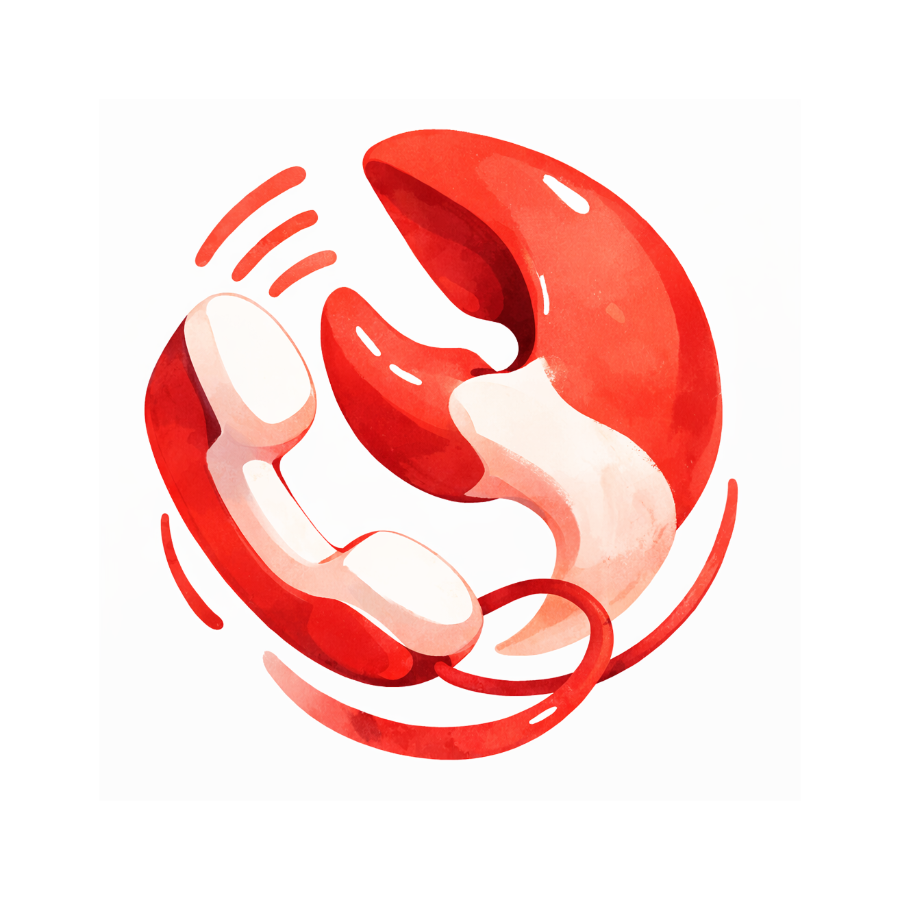

# CallingClaw

Your AI agent is smart but it can't join your meetings. CallingClaw fixes that. It joins Google Meet as a real participant with voice, vision, and hands. It listens to the conversation, speaks when spoken to, shares its screen to present documents, scrolls through pages, clicks buttons, and captures action items. After the meeting, it sends a branded summary to Telegram.

> **~5 minutes to your first AI meeting.** Your agent does the setup. Backend starts in 3 seconds (Bun, no Docker). Dependencies install on first launch. You just paste API keys.
>
> **Runs locally on your Mac.** No cloud servers, no data leaving your machine. Bring your own API keys. macOS 13+ required.

<p align="center">
  
</p>


**v2.9.2** · [www.callingclaw.com](https://www.callingclaw.com) · [Changelog](CHANGELOG.md)

---

## Start here: paste this into Claude Code

Copy this block into [Claude Code](https://claude.ai/code). The agent will clone the repo, install everything, walk you through API key setup, and verify the system is healthy. Do not skip steps.

```
GOAL: Set up CallingClaw — an AI meeting assistant that joins Google
Meet with voice, vision, and screen control. Get me to a working
system where I can join my next meeting. Do not skip steps. Verify
each step before proceeding.

CallingClaw is a Bun backend + Electron desktop app. It needs API
keys for voice (Gemini or OpenAI) and optionally Google OAuth for
calendar auto-join. Read CLAUDE.md for the full architecture.

STEP 1 — CLONE & INSTALL
  git clone https://github.com/XEasonChan/callingclaw.git
  cd callingclaw/callingclaw-backend && bun install
  cd ../callingclaw-desktop && npm install
  Verify: both install without errors

STEP 2 — API KEYS
  cp callingclaw-backend/.env.example callingclaw-backend/.env
  Ask me for each key. At minimum I need ONE voice key:
    GEMINI_API_KEY    — recommended (free tier, 10x cheaper)
    OPENAI_API_KEY    — alternative (best tool calling)
    XAI_API_KEY       — alternative (cheapest)
  Optional but recommended:
    OPENROUTER_API_KEY — for vision, analysis, computer use
  Verify: keys are non-empty in .env

STEP 3 — START BACKEND
  cd callingclaw-backend && bun run src/callingclaw.ts
  Verify: curl http://localhost:4000/api/status returns
  {"callingclaw":"running","version":"2.9.2",...}

STEP 4 — GOOGLE ACCOUNT (optional, for calendar + Meet join)
  Open http://localhost:4000 in a browser. Click "Sign in with Google"
  in the onboarding flow. This opens Chrome where you sign into your
  Google account. CallingClaw imports the cookies for Meet access.
  For calendar: add GOOGLE_CLIENT_ID, GOOGLE_CLIENT_SECRET, and
  GOOGLE_REFRESH_TOKEN to .env (run scripts/refresh-google-token.ts
  to generate the refresh token).
  Verify: curl http://localhost:4000/api/status shows calendar: "connected"

STEP 5 — DESKTOP APP
  cd callingclaw-desktop && npm start
  Grant macOS permissions when prompted: Microphone, Screen Recording,
  Accessibility. The app auto-starts the backend daemon.
  Verify: tray icon appears, main window shows "Engine Running"

STEP 6 — TEST
  Join a test meeting: /callingclaw join <your-meet-url>
  Or use Talk Locally: click any meeting card in the Desktop app
  Verify: AI speaks, transcript appears, action items captured

DONE. Tell me: "CallingClaw is running. Voice provider: [provider].
Calendar: [connected/not configured]. Ready to join meetings."
```

### Without Claude Code

```bash
# Download the DMG (easiest)
# Get CallingClaw-2.9.2-arm64.dmg from Releases:
open https://github.com/XEasonChan/callingclaw/releases/latest

# Or from source:
git clone https://github.com/XEasonChan/callingclaw.git
cd callingclaw && cd callingclaw-backend && bun install
cp .env.example .env   # add your API keys
bun run src/callingclaw.ts
# Open http://localhost:4000 in your browser
```

> **For AI agents:** [`CLAUDE.md`](CLAUDE.md) contains the complete architecture, module wiring, 5-layer context model, and known gotchas. It is the single source of truth for programmatic understanding of this codebase.

---

## The full meeting lifecycle

CallingClaw doesn't start when you join a meeting. It starts when you have an idea.

```
You say: "帮我安排一个会讨论 Website Launch Timeline"

  BEFORE THE MEETING
  ──────────────────
  → Creates Google Calendar event with Meet link
  → Sends invites to participants
  → Researches topic: pulls relevant docs, past decisions, open threads
  → Generates structured prep brief with talking points + questions
  → Builds presentation plan (speaking phases + scenes + documents)
  → Waits. Joins automatically 2 minutes before start time.

  DURING THE MEETING
  ──────────────────
  → Announces itself as AI, introduces the agenda
  → Real-time voice conversation (~300ms, System 1)
  → Perceives shared screens via Gemini Flash every 40s
  → Shares its own screen to present docs, scroll, click
  → Captures action items AS they happen (not post-meeting)
  → System 2 runs in parallel: searches memory, pulls context,
    answers "what did we decide last time?" instantly

  AFTER THE MEETING
  ─────────────────
  → Generates branded HTML summary with action items
  → Sends to Telegram for review and confirmation
  → Creates tasks with owners and deadlines
  → Updates memory with new decisions and context
  → Executes follow-up tasks: draft emails, update docs, file tickets
  → Next meeting on this topic: arrives with full history
```

The meeting is the middle of the workflow, not the whole workflow. CallingClaw handles before, during, and after so you can focus on the actual conversation.

---

## The dual-brain meeting architecture

Most meeting AI is a tape recorder. CallingClaw is a participant.

| | Tape Recorders | CallingClaw |
|---|---|---|
| **During meeting** | Silent recording | Real-time voice conversation |
| **Screen** | Can't see | Perceives shared screens, shares its own |
| **Context** | None | Prep brief + past decisions + live search |
| **Action items** | Post-meeting extraction | Captured as they happen |
| **Computer control** | None | Opens files, navigates pages, clicks buttons |
| **Output** | Transcript + summary | Summary + action items + follow-up execution |

Two models work in parallel. System 1 (fast) handles the live conversation. System 2 (deep) handles research, prep, and post-meeting delivery.

```
┌─────────────────────────────────────────────────────────────┐
│                CallingClaw Backend (Bun :4000)                │
│                                                              │
│  System 1 (Fast, ~300ms)          System 2 (Deep, ~15s)      │
│  ┌──────────────────────┐         ┌────────────────────────┐ │
│  │ Voice    → Realtime   │         │ Prep    → OpenClaw     │ │
│  │ Auditor  → Haiku      │         │ Search  → Claude Code  │ │
│  │ Vision   → Gemini     │         │ Summary → Telegram     │ │
│  │ Retrieve → Haiku      │         │ Tasks   → Action items │ │
│  └──────────────────────┘         └────────────────────────┘ │
│                                                              │
│  Chrome (Playwright)              Meeting Stage (/stage)     │
│  ┌──────────────────────┐         ┌────────────────────────┐ │
│  │ Tab 1: Google Meet    │         │ Left: Presentation     │ │
│  │ Tab 2: Presenting     │         │ Right: S1 + S2 feed    │ │
│  │ Audio injection       │         │ Working documents      │ │
│  │ Page Agent DOM extract│         │ EventBus → WebSocket   │ │
│  └──────────────────────┘         └────────────────────────┘ │
└─────────────────────────────────────────────────────────────┘
```

---

## Voice providers

Set `VOICE_PROVIDER` in `.env` or switch at runtime via the Desktop UI.

| Provider | Cost | Latency | Session | Best For |
|----------|------|---------|---------|----------|
| **Gemini 3.1 Live** | ~$0.02/min | ~400ms | 15 min (auto-resume) | Daily use, free tier available |
| OpenAI Realtime 1.5 | ~$0.30/min | ~300ms | 120 min | Tool calling, long meetings |
| Grok (xAI) | ~$0.05/min | ~350ms | 30 min | Web search, X integration |

At minimum you need **one voice key**. Gemini is recommended to start (free tier, best cost-to-quality ratio).

---

## API keys

| Key | What For | Get It |
|-----|----------|--------|
| `GEMINI_API_KEY` | Voice (default), vision | [aistudio.google.com/apikey](https://aistudio.google.com/apikey) |
| `OPENAI_API_KEY` | Voice (alternative) | [platform.openai.com/api-keys](https://platform.openai.com/api-keys) |
| `OPENROUTER_API_KEY` | Computer use, analysis, intent classification | [openrouter.ai/keys](https://openrouter.ai/keys) |
| `GOOGLE_CLIENT_ID` + `SECRET` + `REFRESH_TOKEN` | Calendar auto-join, Meet access | Google Cloud Console OAuth 2.0 |

---

## macOS permissions

Prompted automatically on first launch:

| Permission | Why |
|-----------|-----|
| **Microphone** | Voice capture for local conversations |
| **Screen Recording** | Screenshot analysis during meetings |
| **Accessibility** | Computer control (click, type, scroll) |

---

## How CallingClaw fits with Claude Code

CallingClaw is the meeting layer. Claude Code is the reasoning layer.

When you run CallingClaw inside Claude Code (via the `/callingclaw` skill or the Telegram Channel plugin), Claude Code becomes System 2: it receives meeting events, runs deep research, generates prep briefs, and delivers post-meeting summaries. CallingClaw's System 1 handles the real-time voice conversation independently.

They're complementary:
- **CallingClaw** = ears, mouth, eyes, hands (real-time meeting participation)
- **Claude Code** = brain (deep reasoning, memory, file access, task execution)

The [`plugins/callingclaw-events`](plugins/) bridge connects them via EventBus → MCP Channel. Your Telegram becomes the control plane.

---

## Project structure

```
callingclaw/
├── callingclaw-backend/     # Bun backend (AI orchestration, voice, meeting lifecycle)
├── callingclaw-desktop/     # Electron app (UI, audio bridge, tray, onboarding)
├── plugins/                 # Claude Code Channel plugin (EventBus → Telegram)
├── CLAUDE.md                # Agent guide — architecture, rules, gotchas
├── CHANGELOG.md             # Release history
└── VERSION                  # 2.9.2
```

---

## Troubleshooting

**Backend won't start:** `lsof -i :4000` → `kill` the stale process.

**No voice audio:** Check API key in `curl http://localhost:4000/api/status`. Verify mic is not set to BlackHole.

**Meet audio not working:** Ensure Chrome is logged into Google. Mic must be ON in Meet (audio injection requires mic permission).

**Desktop shows "Engine Not Started":** Click "Start Engine" or restart the app. Check `.env` has valid API keys.

**Calendar not connecting:** Run `bun run scripts/refresh-google-token.ts` to regenerate the OAuth refresh token.

---

## License

Apache License 2.0 — see [LICENSE](LICENSE)
