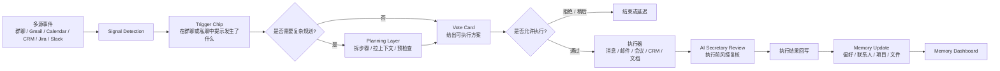

# Tanka Proactive AI Agent — PRD v5.0 精简版

版本：5.0  
日期：2026-03-20  
状态：在 v4.0 基础上去重、对齐、重组后的主文档

## 0. 这次 5.0 的整理原则

### 0.1 删除的重复表达

- `Trigger Chip / Action Card / Memory Dashboard` 在 v4.0 中被多个章节反复解释，本版统一收敛到一条主链路。
- `群助手 Agent`、`Personal Assistant`、`Flow Agent` 在 v4.0 中既像“产品角色”，又像“系统模块”，本版统一拆开。
- `智能权限`、`权限 Vote Card`、`Memory Level`、`Dashboard` 在 v4.0 中互相交叉引用过多，本版统一收拢到“权限与信任模型”。
- `Git 版本云盘`、`Artifact`、`文件留存` 在 v4.0 中分散出现，本版统一命名为 `Git Cloud Drive`。

### 0.2 修正的核心逻辑不一致

- `Planning Card` 不再被定义为独立产品概念。  
  最新逻辑：Planning 是 `Trigger -> Vote` 之间的中间过程层，只在复杂、多步、长耗时任务中出现。

- `群助手` 不再是用户可见的独立 AI 身份。  
  最新逻辑：前台永远只有每个用户自己的 `Personal AI Assistant`；群聊里只有系统级 Trigger，不出现独立“群机器人”发言。

- `Action Card` 与 `Vote Card` 不再混用。  
  最新逻辑：所有可审批执行方案统一叫 `Vote Card`；`Action Card` 仅作为产品抽象层术语，不再作为单独 UI 名词。

- `Memory Alignment Level` 不直接等于“自动化权限”。  
  最新逻辑：Level 只影响默认确认深度和展示颗粒度，不突破高风险安全底线。

- `Flow` 不再和短任务触发混写。  
  最新逻辑：单次动作走 `Trigger -> Vote -> Execute`；跨天、多信号、多产出的任务才升级为 `Flow`。

### 0.3 5.0 的统一产品主线

`Signal Detection -> Trigger Chip -> Planning -> Vote -> Execute -> Review -> Memory Update -> Dashboard`

---

## 1. 背景与整体流程图

### 1.1 产品背景

Tanka Proactive AI Agent 的核心目标，不是做一个会聊天的 AI，而是做一个能持续观察团队协作、主动提出执行方案、并在可控权限下完成跨工具动作的数字员工。

它解决的是三个连续问题：

1. 用户的重要信号分散在群聊、邮件、日历、CRM、项目工具中，AI 没有统一感知入口。
2. AI 即使发现了信号，也常停留在“提醒一下”层，无法把建议推进成可执行方案。
3. AI 执行后缺少稳定的记忆沉淀、权限成长路径和可追溯的结果看板。

### 1.2 产品定位

- 对用户：一个始终在线的 `Personal AI Assistant`
- 对团队：一个会在群聊语境中工作的 `Proactive Work Layer`
- 对系统：一个由 `信号层 + 规划层 + 审批执行层 + 记忆层` 组成的主动协作引擎

### 1.3 整体流程图

### 1.4 前台可见的四个层

- `Trigger Chip`：告诉用户 AI 看到了什么。
- `Planning`：告诉用户 AI 准备怎么做，只在复杂任务出现。
- `Vote Card`：让用户批准、修改、拒绝或授权。
- `Memory Dashboard`：让用户看到 AI 记住了什么、做了什么、当前处在什么协作等级。

---

## 2. 目标实现的 Use Case

### 2.1 P0 主用例

| Use Case | 触发来源 | 用户价值 | 默认输出 |
|---|---|---|---|
| 群聊会议发现 -> 自动约会 | 群聊 + 跨渠道确认 | 从讨论直接进入安排 | Meeting Vote |
| 群聊任务分配 -> 创建 Jira/Linear | 群聊任务信号 | 从口头安排进入结构化跟进 | Task Vote |
| 会后自动跟进 -> 邮件 + CRM | Meeting ended + transcript | 从会议结束直接进入 follow-up | Compound Vote |
| 客户邮件/反馈 -> 草拟回复或建单 | Gmail/Slack/HubSpot | 从收到信号直接进入响应 | Reply / Issue Vote |
| 定期简报/周报/项目摘要 | 定时任务 + 多源聚合 | 从信息过载进入可读产出 | Planning + Deliverable Vote |

### 2.2 P1 扩展用例

| Use Case | 触发来源 | 升级条件 |
|---|---|---|
| 多个相关信号聚合成项目 | 两周内同主题多信号 | 升级成 Flow |
| 群聊中的角色定制建议 | 群聊 + role awareness | 不同成员看到不同 Trigger |
| Git Cloud Drive 文件协同 | Flow / Deliverable | 需要版本化产出物 |
| 智能权限升级建议 | 高频低风险动作 | 用户长期批准稳定 |

### 2.3 5.0 的用例边界

- 单步、秒级、低不确定性任务：直接 Trigger -> Vote。
- 多步、分钟级、需要多源信息准备的任务：Trigger -> Planning -> Vote。
- 跨天、持续监控、需要文件沉淀和状态跟踪的任务：升级为 Flow。

---

## 3. Trigger 的设计与交互逻辑

### 3.1 Trigger 的定义

Trigger 是 AI 从连续协作行为中抽取出的“可行动信号”。  
它不是通知泛滥，也不是消息摘要，而是满足“现在值得用户处理”的最小决策单元。

### 3.2 Trigger 的设计原则

- 只表达一件事：发生了什么，为什么重要。
- 不直接承载复杂操作，复杂动作必须进入 Vote。
- 在群聊中保持轻量，不打断正常聊天流。
- 必须可追溯到原始来源、信心值、相关人和相关对象。

### 3.3 Trigger 的统一字段

| 字段 | 说明 |
|---|---|
| `source` | 来自哪个 app / 群 / 线程 / 对象 |
| `type` | 信号类型 |
| `summary` | 一句话说明发生了什么 |
| `why_now` | 为什么现在值得处理 |
| `related_people` | 涉及的人 |
| `confidence` | 信号置信度 |
| `next_step` | 默认建议动作 |
| `status` | new / viewed / acted / dismissed / expired |

### 3.4 Trigger 的交互逻辑

#### 群聊内

- 以轻量 `Chip` 形式挂在相关消息下方。
- 用户点击后，右侧 Personal AI 打开详情。
- 群聊中不直接显示完整执行方案。

#### 私聊内

- 以“主动消息 + Trigger 列表”形式出现。
- 可直接进入 Vote，适合跨渠道聚合通知。

#### Flow 内

- Trigger 不再是短提醒，而是作为项目事件流的一部分写入 Flow 时间线。

### 3.5 当前 Trigger 列表

| 类别 | Trigger | 来源 | 默认去向 |
|---|---|---|---|
| 群聊协作 | `meeting_intent` | Tanka 群聊 / Slack 群聊 | Meeting Vote |
| 群聊协作 | `task_assignment` | 群聊消息 | Task Vote |
| 群聊协作 | `decision_made` | 群聊讨论 | Summary / ADR / Flow |
| 群聊协作 | `reply_needed` | @mention / 问题点名 | Reply Vote |
| 群聊协作 | `follow_up_needed` | 群聊行动项 / deadline | Follow-up Vote |
| 邮件 | `new_email_high_priority` | Gmail / Outlook | Reply Vote |
| 邮件 | `follow_up_due` | Gmail / CRM 历史 | Follow-up Vote |
| 日历/会议 | `meeting_ended` | Calendar / Zoom / Meet | Summary + Follow-up Vote |
| 日历/会议 | `calendar_conflict` | Calendar | Reschedule Vote |
| CRM | `deal_stage_change` | HubSpot / Salesforce | CRM Update Vote |
| CRM | `contact_activity` | CRM / email tracking | Follow-up Vote |
| 项目工具 | `ticket_blocked` | Jira / Linear | Alert / Resolution Vote |
| 项目工具 | `sprint_complete` | Jira / Linear | Summary Deliverable |
| 多源聚合 | `multi_signal_aggregation` | Cross-channel | Flow Suggestion / Compound Vote |
| 定时任务 | `scheduled_digest_ready` | Cron + aggregation | Deliverable Vote |

### 3.6 5.0 对 Trigger 的关键收敛

- `Smart Meeting / Smart Reply / Smart Follow-up / Smart Summary / Smart Alert` 保留为前台文案层，不再作为底层 trigger schema。
- 底层统一使用结构化 trigger type，前台按场景映射成用户可读标题。
- `群聊确认` 和 `跨渠道确认` 不再是两个体系，统一归入 `multi_signal_aggregation`。

---

## 4. Planning 的设计与交互逻辑

### 4.1 Planning 的定位

Planning 不是新卡片类型，而是复杂任务在投票前的“执行准备态”。

它解决三个问题：

1. 任务涉及多个工具时，用户需要知道 AI 打算怎么串起来。
2. 任务耗时超过几秒时，用户需要过程透明度。
3. 任务涉及文件产出时，用户需要先看到草稿或结构。

### 4.2 何时进入 Planning

符合任一条件即进入 Planning：

- 需要调用 2 个及以上外部工具
- 需要读取或生成文件
- 需要多步执行且存在先后依赖
- 需要跨系统校验数据
- 预计执行时长 > 10 秒

### 4.3 Planning 的产物

| 产物 | 说明 |
|---|---|
| Step List | 计划执行的步骤 |
| Inputs | AI 读取了哪些上下文 |
| Risks | 发现了哪些需要用户注意的风险 |
| Draft | 需要审批的草稿内容 |
| Tool Scope | 会调用哪些工具和权限 |

### 4.4 Planning 的交互逻辑

| 场景 | 交互 |
|---|---|
| 简单任务 | 不显示 Planning，直接进 Vote |
| 多步任务 | 先显示 Planning 摘要，再提交 Vote |
| 长耗时任务 | Planning 持续更新步骤状态 |
| 用户要求修改 | 回到 Planning 重算，再生成新 Vote |

### 4.5 Planning 的状态

`draft -> preparing -> ready_for_vote -> revising -> approved -> executing`

### 4.6 5.0 的关键决策

- `Plan A / Plan B` 不再作为并行产品路线。  
  最新逻辑：这是同一交互链路上的两种显示深度。

- `Planning Card` 不独立计数、不独立埋点。  
  埋点归属于其后对应的 Vote 和执行结果。

- Planning 的核心不是“展示 AI 思考”，而是“展示执行计划与风险”。

---

## 5. Action Card（Vote）的设计与交互逻辑

### 5.1 统一定义

所有需要用户做出明确执行决策的方案，都统一使用 Tanka 现有 `Vote Card` 组件表达。

### 5.2 Vote 的结构

| 区块 | 内容 |
|---|---|
| Header | 动作标题 + 目标对象 |
| Context | 信号来源、摘要、相关上下文 |
| Draft / Payload | 将发送什么、更新什么、创建什么 |
| Options | 方案 A / 方案 B / Decline |
| Permission | 涉及的 app 和权限范围 |
| Action | Execute / Send / Create / Update / Defer |

### 5.3 Vote 的交互逻辑

1. AI 基于 Trigger 或 Planning 生成一个可审批方案。
2. 用户可以直接批准、编辑后批准、切换备选方案、拒绝、稍后处理。
3. 如需要新权限，Vote 内嵌权限确认，不再跳出独立流程。
4. 执行完成后，Vote 更新为结果态，并沉淀进历史与记忆。

### 5.4 Vote 的状态机

`draft -> proposed -> user_editing -> approved -> reviewing -> executing -> done / failed / blocked / deferred`

### 5.5 Vote 的分类

| 类型 | 说明 | 示例 |
|---|---|---|
| Single-step Vote | 单动作执行 | 发消息、发邮件、更新 CRM |
| Compound Vote | 多步打包执行 | 建会议 + 发邀请 + 群通知 |
| Deliverable Vote | 先产出内容再执行 | 周报、会议纪要、摘要 |
| Permission Vote | 请求新增权限 | 允许某项目内自动发 follow-up |

### 5.6 当前已经实现/已明确的 Vote 模板

说明：以下“当前 Vote”基于现有 v4.0 文档和原型定义做统一整理，不等同于代码全部上线。

| Vote 模板 | 动作标题 |
|---|---|
| Tanka Send to Chat | 给单人发消息 |
| Tanka Send to Group | 给群发消息 |
| Linear Update Task | 更新任务 |
| Jira Create Issue | 创建 Issue |
| Gmail Send Email | 发送单封邮件 |
| Gmail Send to N People | 批量发送 |
| Zoom Create Meeting | 创建会议 |
| HubSpot Update Deal | 更新 CRM Deal |
| Notion Create Page | 创建文档 |
| Notion Update Page | 更新文档 |
| Sheets Add Rows | 写入表格 |
| Compound: Create Meeting + Notify | 多步执行 |

### 5.7 5.0 对 Vote 的关键收敛

- 前台统一只说 `Vote`，不再同时说 `Action Card / Proposal Card / Permission Card`。
- 复杂度差异通过 Context、Draft、Options、Review Depth 展示，不通过不同卡片样式表达。
- 权限请求是 Vote 的一个变种，不再另开一套 UI 心智。

---

## 6. 群聊里的信号收集

### 6.1 群聊信号收集的目标

AI 不在群里“说话”，而是在群里“观察、理解、归纳、触发”。

### 6.2 采集对象

- 会议意图
- 任务分配
- 决策形成
- 明确同意/拒绝/待定
- deadline、owner、依赖关系
- 需要某个角色回应的问题
- 需要升级为 Flow 的连续议题

### 6.3 核心逻辑

| 模块 | 作用 |
|---|---|
| Message Parser | 解析单条消息的意图、实体、语气 |
| Thread Aggregator | 聚合同一话题下的多条消息 |
| Participant Resolver | 识别谁在确认、谁在反对、谁尚未回应 |
| Cross-channel Resolver | 把 Slack/Gmail/CRM 的回应归并到同一任务 |
| Threshold Engine | 判断是否满足触发条件 |

### 6.4 群聊场景下的用户体验原则

- 群聊中只出现轻提示，不直接刷 AI 长消息。
- 同一事件在群聊中只保留一个主 Trigger，避免刷屏。
- 群成员看到的 Trigger 允许不同，取决于其 role、权限、是否为 owner。
- 最终执行结果以用户本人名义回流到群聊。

### 6.5 5.0 的关键决策

- `群聊确认收集` 是能力，不是单独 use case。
- `群聊 Context 模式` 继续保留，但本质是 Personal AI 读取当前群语境，而不是一个群 bot 在工作。

---

## 7. Role Awareness 与 Git Cloud Drive

### 7.1 Role Awareness 的定义

同一个群、同一个信号、同一个项目，不同角色看到的 Trigger、Planning 和 Vote 不同。

### 7.2 Role Awareness 的决策输入

| 维度 | 来源 |
|---|---|
| 组织角色 | title / team / manager 关系 |
| 项目角色 | owner / approver / watcher / contributor |
| 历史行为 | 经常审批什么、经常忽略什么 |
| 当前上下文 | 正在看的群、当前 Flow、最近会议 |
| 权限范围 | 能看什么、能批什么、能执行什么 |

### 7.3 Role-aware 输出规则

| 角色 | 默认输出 |
|---|---|
| 发起人/Owner | 完整 Vote + 风险 + 执行按钮 |
| Manager | 摘要 + 审批选项 + 升级建议 |
| Contributor | 与自己相关的任务或回复建议 |
| Watcher | 低打扰摘要，不默认推执行 |

### 7.4 Git Cloud Drive 的定位

Git Cloud Drive 是所有长文档、周报、纪要、研究、Flow 产出物的文件化记忆底座。

### 7.5 Git Cloud Drive 的设计原则

- 所有正式交付物都文件化，而不是只存在聊天消息里。
- 所有文件都有版本，不覆盖历史。
- 文件和 Trigger / Vote / Flow / 执行记录互相链接。
- 文件同时是“产出物”也是“长期记忆源”。

### 7.6 Git Cloud Drive 的典型对象

- 会议纪要
- 周报 / 日报 / Brief
- 项目状态报告
- 客户跟进摘要
- ADR / 决策记录
- 竞品分析 / 研究文档

---

## 8. 智能权限管理与 AI 秘书兜底二次审核提醒

### 8.1 权限模型

权限判断由三个层次组成：

1. `Tool Permission`：这个工具能不能用。
2. `Action Permission`：这个动作能不能做。
3. `Confirmation Level`：这个动作做到什么确认深度。

### 8.2 确认级别

| Level | 名称 | 行为 |
|---|---|---|
| L1 | Silent | 自动执行，时间线可追溯 |
| L2 | Notify | 执行后通知，可短时撤回 |
| L3 | Confirm | 标准 Vote 审批 |
| L4 | Deep Review | 增强上下文审核 |
| L5 | Multi-gate | 多步逐级确认 |

### 8.3 决策因子

- 对象重要性
- 内容敏感度
- 时间风险
- 是否例行模式
- 用户当前 Memory Level
- 历史审批稳定性
- 动作可逆性

### 8.4 权限 Vote 设计

统一使用三选项：

- `仅这次`
- `在当前项目/Flow 内始终允许`
- `拒绝`

### 8.5 AI 秘书兜底二次审核

用户点击通过后，并不等于立即落地执行。  
所有中高风险动作都经过 `AI Secretary Review` 进行执行前复核。

### 8.6 AI Secretary Review 要检查什么

| 检查项 | 示例 |
|---|---|
| 收件人/对象是否正确 | 发错邮箱、发错客户 |
| 时间与时区是否合理 | 会议时间落在对方深夜 |
| 数据是否一致 | 邮件里的金额和 CRM 不一致 |
| 附件是否完整 | 文案提到附件但没有附件 |
| 是否重复执行 | 5 分钟前已发过同内容 |
| 是否越权 | 本次动作超出授权边界 |

### 8.7 兜底提醒机制

若复核发现问题，不直接失败，而是回到用户面前做二次提醒：

- `等一下，我发现一个风险`
- 标出问题位置
- 给出修正建议
- 支持 `继续执行 / 修改后执行 / 取消`

### 8.8 5.0 的安全底线

- 高风险对象不会因 Memory Level 升高而降到全自动。
- 权限的成长只降低低风险动作的摩擦，不突破高风险边界。
- `Memory Level` 和 `Permission Level` 必须分开存储、分开解释。

---

## 9. Memory Dashboard

### 9.1 Dashboard 的角色

Memory Dashboard 不是“设置页”，而是 AI 和用户之间的协作透明层。

它必须回答五个问题：

1. AI 现在记住了什么？
2. AI 最近做了什么？
3. AI 对哪些群、联系人、项目在持续关注？
4. AI 当前可以自动做到什么程度？
5. 下一步怎样升级得更好，而不是更危险？

### 9.2 新的等级设计

5.0 在原有 1-5 基础上增加 `Lv.0`，把初始化状态说清楚。

| Level | 名称 | 定义 | 默认状态 |
|---|---|---|---|
| Lv.0 | 未建立 | 未连接工具、无稳定记忆、只能被动聊天 | 初始默认 |
| Lv.1 | 观察中 | 已接入基础数据，能识别低风险信号 | 新用户 |
| Lv.2 | 试用中 | 可做轻量提醒和草稿生成 | 完成首批连接 |
| Lv.3 | 新同事 | 能稳定完成标准协作任务 | 已有持续审批记录 |
| Lv.4 | 得力助手 | 对常规工作形成稳定默契 | 低风险动作高通过 |
| Lv.5 | 左右手 | 在低风险、高频任务上高度自治 | 长期稳定使用 |

### 9.3 等级初始化与升级逻辑表

| Level | 进入条件 | 升级条件 | 降级条件 |
|---|---|---|---|
| Lv.0 | 默认初始 | 连接至少 1 个核心工具并产生首个可用 Trigger | 无 |
| Lv.1 | 有基础连接 | 7 天内产生有效 Trigger 且用户处理 >= 3 次 | 长期无使用 |
| Lv.2 | 已有轻量互动 | 14 天内批准 >= 5 次，成功执行 >= 3 次 | 通过率持续过低 |
| Lv.3 | 有稳定协作 | 30 天内多源信号稳定、拒绝率低、至少 1 个项目持续跟进 | 错误率或拒绝率明显升高 |
| Lv.4 | 已形成工作默契 | 高频低风险动作具备稳定模式，用户开始开放项目级权限 | 风险拦截频繁、权限被回收 |
| Lv.5 | 长期稳定协作 | 60 天以上稳定使用，多个 Flow 持续运行，文件化记忆和角色感知完整 | 高风险误判或长期停用 |

### 9.4 等级不直接决定什么

- 不直接决定是否能给高风险对象自动发信。
- 不直接代表“模型更聪明”。
- 不直接代替审批链。

### 9.5 Dashboard 的数据维度

在 v4.0 的六维基础上，5.0 扩展为九维：

| 维度 | 说明 |
|---|---|
| Productivity | 产出量：完成了多少动作和交付物 |
| Approval Quality | 通过率：用户批准、拒绝、修改分布 |
| Coverage | 覆盖度：覆盖了多少群、项目、联系人、工作域 |
| Signal Health | 信号健康度：有效 trigger 比例、噪音率、过期率 |
| Automation Depth | 自动化深度：L1/L2/L3/L4/L5 动作分布 |
| Permission Footprint | 权限版图：连接了哪些 app、开放到什么粒度 |
| Role Fit | 角色适配度：不同角色触发和采用情况 |
| File Memory | 文件记忆量：产出物数、版本数、被回用次数 |
| Live Status | 当前状态：正在监控、正在规划、等待审批、执行中 |

### 9.6 Dashboard 的核心模块

| 模块 | 内容 |
|---|---|
| Memory Level 概览 | 当前等级、升级路径、最近变化 |
| Signal Monitor | 正在监控的群、线程、项目、联系人 |
| Execution History | Trigger -> Vote -> Result 的完整链路 |
| Connectors & Permissions | 工具连接与权限矩阵 |
| Role Awareness | 重要角色、角色覆盖、个性化命中情况 |
| Git Cloud Drive | 关键文件、最近版本、复用热度 |
| Suggestions | 推荐连接、推荐升级权限、推荐创建 Flow |

---

## 10. 文件化记忆留存

### 10.1 设计目标

所有对未来有复用价值的 AI 产出，都必须文件化，而不是只存在聊天记录里。

### 10.2 哪些内容必须文件化

- 会议纪要
- 决策记录
- 周报 / 月报 / brief
- 项目阶段总结
- 客户沟通摘要
- 研究型长文档
- Flow 的中间和最终交付物

### 10.3 文件化记忆的统一结构

| 字段 | 说明 |
|---|---|
| `memory_file_id` | 文件唯一 ID |
| `title` | 文件标题 |
| `type` | summary / brief / report / adr / note / research |
| `linked_signal_ids` | 来源信号 |
| `linked_vote_ids` | 对应审批记录 |
| `linked_flow_id` | 所属项目 |
| `version` | 当前版本 |
| `status` | draft / approved / published / archived |
| `owners` | 相关人 |
| `tags` | 客户 / 项目 / 主题 / 角色 |

### 10.4 文件化记忆的沉淀逻辑

`Trigger / Flow -> Planning -> Draft File -> Vote -> Approved File -> Git Cloud Drive -> Dashboard & Retrieval`

### 10.5 5.0 的关键决策

- 文件是长期记忆的主载体，聊天只是入口。
- 文件必须支持版本历史、引用来源、回溯到原始 Trigger。
- Memory 检索优先从结构化文件中召回，而不是只从聊天文本里召回。

---

## 11. 5.0 最终统一规则

### 11.1 一个用户只看到一个 AI

无论群聊、私聊还是 Flow，用户前台只感知到自己的 `Personal AI Assistant`。

### 11.2 一个动作只走一条链

- 短动作：`Trigger -> Vote -> Execute`
- 复杂动作：`Trigger -> Planning -> Vote -> Execute`
- 长期项目：`Trigger 聚合 -> Flow -> Deliverable / Vote / Execute`

### 11.3 一个权限只解释一件事

- 工具能不能用
- 动作能不能做
- 这次要不要确认

### 11.4 一个结果必须能追溯

任何执行结果都必须回溯到：

- 来自哪个 Trigger
- 经过哪个 Vote
- 用了什么权限
- 产出了什么文件
- 更新了哪段 Memory

---

## 12. 建议的后续拆文方式

5.0 作为主 PRD 后，后续建议拆成四份子文档维护，避免再次膨胀：

1. `PRD 5.0 主文档`：只保留产品逻辑、对象模型、用户流。
2. `Trigger & Vote Spec`：只写触发、投票、状态、埋点。
3. `Permission & Review Spec`：只写权限和 AI Secretary 风控。
4. `Memory Dashboard & Git Cloud Drive Spec`：只写等级、看板、文件化记忆。
