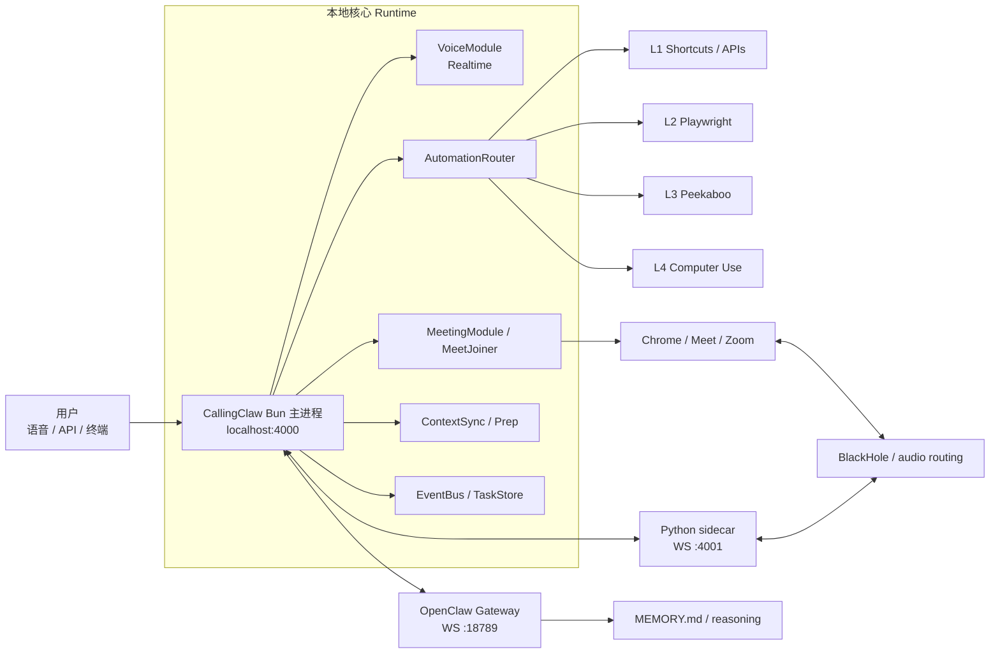
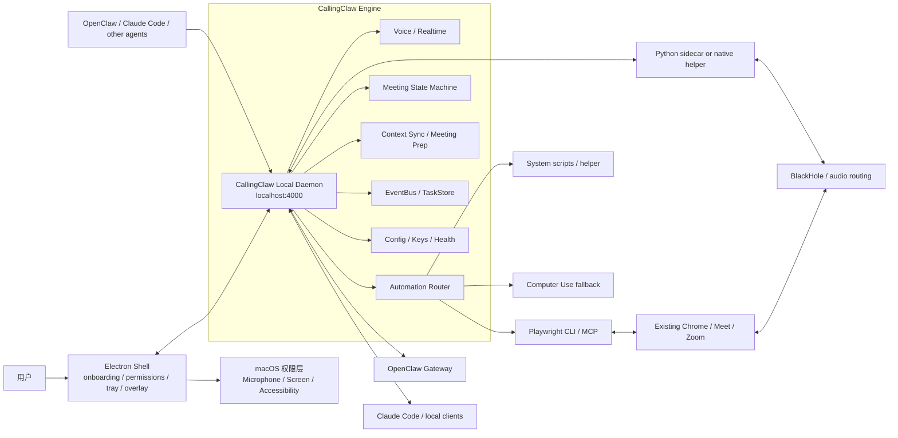
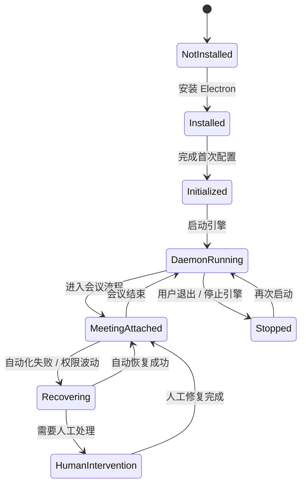
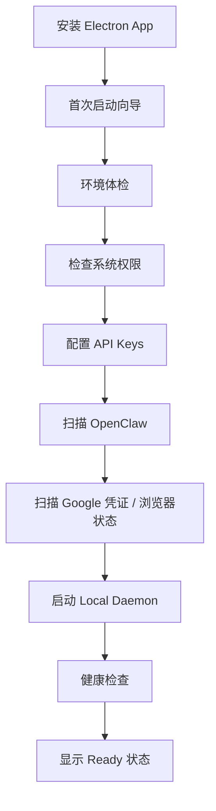
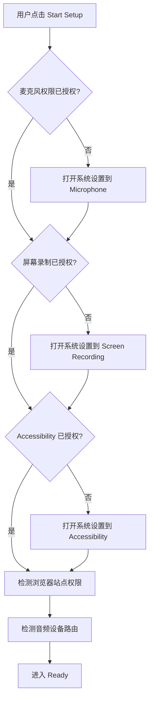
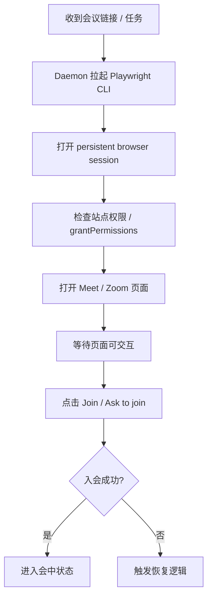
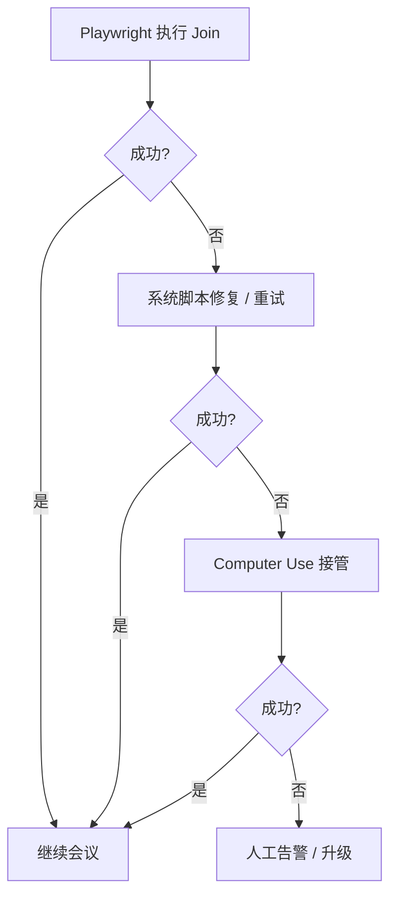
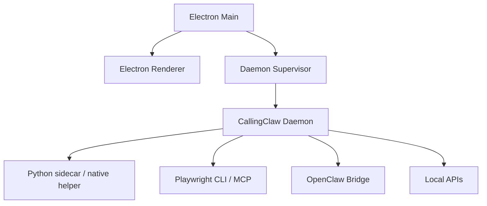

# CallingClaw Bun → Electron 升级需求文档

## 1. 文档信息

- 项目：CallingClaw Desktop Upgrade
- 目标：将当前以 Bun 本地服务为主入口的 CallingClaw，升级为 **Electron Shell + Local Daemon + Tool Sidecars** 的桌面产品架构
- 文档用途：供工程团队进行架构调整、权限流设计、桌面端实现与自动化迁移
- 当前阶段：架构与需求定义

---

## 2. 背景与升级目标

### 2.1 当前问题

当前 CallingClaw 已具备本地运行时能力，包括：

- Bun 主进程
- Python sidecar（音频 / 截屏 / 键鼠）
- OpenClaw bridge
- `localhost:4000` REST API
- 会议能力、语音能力、自动化路由能力

但当前产品入口偏工程化，主要问题包括：

1. 启动和配置依赖终端，用户心智复杂
2. 权限获取分散在 Terminal / Browser / 系统设置中，不利于产品化
3. 无统一的桌面层来承载 tray、overlay、状态显示和初始化流程
4. 浏览器会议自动化虽然可行，但权限检查、失败恢复、状态透明度不足
5. 后续要与 OpenClaw、Claude Code 等 agent 能力协同时，缺少统一的本地 runtime 心智

### 2.2 升级目标

本次升级目标不是重写 CallingClaw 核心引擎，而是：

- 引入 **Electron Shell** 作为桌面控制平面
- 保留 **CallingClaw Local Daemon** 作为本地能力中心
- 继续通过playwright CLI来调用浏览器作为 Meet / Zoom 的实际承载面
- 将现有 CLI / OpenClaw / tool 能力统一接入 daemon
- 将首次安装、权限授权、环境体检、配置管理产品化
- 为无人值守会议加入提供标准主路径和兜底策略

### 2.3 非目标

本次升级 **不包含**：

- 不在electron种加入会议浏览器为内嵌 Chromium 主宿主
- 不移除现有 Bun / Python sidecar 的核心能力
- 不承诺通过 Electron 绕过 macOS 系统权限体系
- 不在本期解决所有系统级音频桥接问题

---

## 3. 总体方案结论

### 3.1 目标架构原则

1. **Browser remains the meeting surface**  
   Google Meet / Zoom 仍运行在用户现有浏览器中

2. **Electron becomes the local control plane**  
   Electron 负责权限、配置、状态、tray、overlay、初始化

3. **Local daemon remains the engine**  
   CallingClaw daemon 继续承担语音、会议状态机、上下文、自动化路由、API 对外能力

4. **CLI-first, GUI-last**  
   优先使用 Playwright CLI / MCP、系统脚本、helper 解决问题；仅在必要时使用 computer use 兜底

5. **Plugin is not the system center**  
   浏览器插件不是本期核心组件；若后续需要，只作为极薄的 browser sensor / bridge

---

## 4. 现有方案 vs Electron 方案对比

### 4.1 当前方案（As-Is）

### 4.2 目标方案（To-Be）

### 4.3 本质区别

| 维度 | 当前方案 | Electron 方案 |
|---|---|---|
| 用户入口 | Terminal / localhost panel | Electron desktop shell |
| 权限心智 | 分散 | 统一在桌面层体检与引导 |
| 后台能力 | Bun 主进程 | Local daemon（可沿用 Bun 核心） |
| 浏览器角色 | 会议承载面 | 仍然是会议承载面 |
| 自动化 | 已具备 | 保留并标准化分层降级 |
| 透明度 | 工程向 | 支持 tray / overlay / 状态可视化 |
| OpenClaw / Claude Code 接入 | 已有能力但产品感弱 | 通过 daemon 成为标准本地 runtime |

---

## 5. 目标架构说明

### 5.1 核心模块

#### A. Electron Shell

职责：

- 安装后首次引导
- 权限检查与授权引导
- 环境体检
- API key / OAuth / OpenClaw 自动发现
- 启动 / 停止 daemon
- tray / overlay / 状态展示
- 错误提示与恢复建议

不负责：

- 不作为会议浏览器主宿主
- 不直接承载复杂 agent 主循环
- 不成为唯一状态源

#### B. CallingClaw Local Daemon

职责：

- 本地常驻后台引擎
- 暴露 `localhost:4000` API
- 管理 voice、meeting、context、router、task、status
- 作为 OpenClaw、Claude Code、Electron 的统一能力中心
- 提供状态、健康检查、配置接口

关键要求：

- UI 关闭后不应影响 daemon 运行
- Electron 重启后应可重新附着 daemon
- 支持自动重连 sidecar / OpenClaw / 浏览器控制层

#### C. Tool Sidecars / Helpers

包括：

- Python sidecar 或 native helper
- Playwright CLI / MCP
- 系统脚本（AppleScript / osascript / SwitchAudioSource 等）
- Computer Use（慢路径兜底）

#### D. Browser Meeting Surface

职责：

- 继续承载 Google Meet / Zoom Web
- 复用用户现有浏览器登录态和网站兼容性
- 避免自己维护 Chromium 会议宿主

---

## 6. Local Daemon 设计

### 6.1 定义

Local daemon 指 CallingClaw 在本机后台常驻的运行时进程，是整个系统的“发动机”。

### 6.2 对外接口

- `localhost:4000` REST API
- WebSocket / SSE（如需）
- 状态查询接口
- 健康检查接口
- 供 Electron / OpenClaw / Claude Code 调用

### 6.3 生命周期

---

## 7. 用户初始化与配置流程

### 7.1 初始化原则

用户不应该“配置 daemon”，而应该感知为：

- 安装 CallingClaw
- 授权电脑能力
- 连接 OpenClaw / AI key
- 启动本地引擎

### 7.2 初始化流程图

### 7.3 环境体检项

- Bun runtime 是否可用
- Python sidecar 依赖是否可用
- PortAudio / 音频桥接依赖是否可用
- BlackHole / SwitchAudioSource 是否安装
- OpenAI / OpenRouter / Anthropic key 是否存在
- OpenClaw 是否安装且 gateway 可达
- Google credentials 是否存在

### 7.4 OpenClaw 接入

- 自动扫描 `~/.openclaw/openclaw.json`
- 自动检测 `ws://localhost:18789`
- 自动尝试 handshake
- 成功后显示 Connected
- 失败后显示明确原因与修复建议

### 7.5 Claude Code 接入

- Claude Code 不直接持有 CallingClaw 状态
- Claude Code 通过本地 daemon API 调用能力
- 后续如需 MCP 化，可将 daemon 封装为 tool runtime / MCP adapter

---

## 8. 权限矩阵与交互设计

### 8.1 权限原则

需要区分三层：

1. **系统权限**：macOS TCC
2. **浏览器 / 站点权限**：Meet / Zoom 的 mic/camera
3. **设备路由配置**：BlackHole / 输入输出设备

Electron 拿到系统权限后，不等于浏览器站点权限和音频设备路由就完全不用配置。

### 8.2 权限矩阵

| 类别 | 权限 / 配置 | 作用对象 | 是否首次人工配置 | 后续是否通常持久 | 负责方 |
|---|---|---|---:|---:|---|
| 系统层 | 麦克风 | CallingClaw / helper | 是 | 是 | Electron 引导 |
| 系统层 | 屏幕录制 | CallingClaw / helper | 是 | 是 | Electron 引导 |
| 系统层 | Accessibility | CallingClaw / helper / Terminal | 是 | 是 | Electron 引导 |
| 浏览器层 | meet.google.com mic/camera | Chrome/Meet | 可能需要 | 通常持久，受浏览器策略影响 | 浏览器 + Playwright |
| 浏览器层 | zoom web mic/camera | Chrome/Zoom | 可能需要 | 通常持久，受浏览器策略影响 | 浏览器 + Playwright |
| 设备层 | 默认输入设备 | 系统 / 浏览器 | 是 | 可能波动 | helper / 用户 |
| 设备层 | 默认输出设备 | 系统 / 浏览器 | 是 | 可能波动 | helper / 用户 |
| 设备层 | BlackHole 路由 | 系统 / Browser / daemon | 是 | 可能波动 | helper / 用户 |

### 8.3 权限引导交互

### 8.4 权限相关产品要求

- 权限检测结果必须可视化
- 必须区分“系统未授权”和“浏览器站点未授权”
- 必须提供“去系统设置修复”的深链接或明确文案
- 权限状态变更后需支持一键重新检测
- 权限项失败不能只显示 generic error，必须给出具体失败项

---

## 9. 无人值守会议主流程

### 9.1 核心假设

远程 Mac mini 可作为无人值守会议 worker，但前提是：

- 已完成人工首次初始化
- 系统权限已就绪
- 浏览器账号已登录
- 音频路由已验证

### 9.2 入会自动化主路径

### 9.3 分层执行策略

| 层级 | 名称 | 适用场景 | 速度 | 稳定性 | 是否主路径 |
|---|---|---|---|---|---|
| L1 | Playwright CLI / MCP | DOM 稳定、网页标准交互 | 快 | 高 | 是 |
| L2 | 系统脚本 / helper | 窗口聚焦、刷新、音频切换 | 中 | 中高 | 是 |
| L3 | Computer Use | selector 失效、非标准弹层、临时改版 | 慢 | 中 | 否，兜底 |
| L4 | 人工介入 | 登录挑战、系统权限、异常状态 | 最慢 | 最高 | 否，最后兜底 |

### 9.4 自动化降级图

---

## 10. Edge Cases / 异常场景

### 10.1 权限类

| 场景 | 风险 | 处理策略 |
|---|---|---|
| Electron 有麦克风权限，但浏览器站点未授权 | 无法在会议中使用 mic | 检测并提示站点权限修复 |
| 系统权限被用户撤销 | helper/automation 失效 | 启动前体检 + 会中健康检查 |
| Accessibility 未授权 | 无法执行系统级修复动作 | 明确降级并提示重新授权 |
| 屏幕录制未授权 | computer use / 截屏分析失败 | 限制功能并提示授权 |

### 10.2 浏览器 / 会议页面类

| 场景 | 风险 | 处理策略 |
|---|---|---|
| Meet / Zoom UI 改版 | selector 失效 | Playwright 失败后转 computer use |
| 非标准弹层 / banner 遮挡按钮 | join 失败 | 先刷新 / dismiss，再 fallback |
| 页面仍在 loading | 提前点击失败 | 增加 ready state 和 timeout 机制 |
| 浏览器 tab 不在前台 | 某些系统动作失败 | 先执行窗口聚焦 |
| SSO / 2FA | 无法自动进入会议 | 直接人工告警 |

### 10.3 音频与设备类

| 场景 | 风险 | 处理策略 |
|---|---|---|
| 默认输入设备被系统切回 | 会议音频链路错误 | 会前 health check + helper 修复 |
| BlackHole 被占用或丢失 | 无法桥接 | 检测失败后阻止自动入会 |
| 浏览器自动切换输入输出设备 | 音频异常 | 入会前后检测设备状态 |
| 多音频设备并存 | 路由混乱 | 提供显式目标设备设定 |

### 10.4 Runtime / 进程类

| 场景 | 风险 | 处理策略 |
|---|---|---|
| Electron 崩溃 | UI 丢失但后台应持续 | daemon 独立进程，支持重连 |
| daemon 崩溃 | 全局能力失效 | 自动重启 + 崩溃上报 |
| Python sidecar 断连 | 音频 / 截屏 / 输入失效 | 自动重连 / 明确错误态 |
| OpenClaw gateway 不可达 | 慢思考不可用 | 降级为本地快速路径 |
| 端口冲突 | daemon 无法启动 | 启动检测 + 引导修复 |

---

## 11. 主要交互要求

### 11.1 Electron 首页状态卡片

必须展示：

- Engine status
- OpenClaw connection status
- Browser automation status
- Voice status
- Audio routing status
- Permissions checklist

### 11.2 Setup Wizard 页面

建议页面：

1. Welcome
2. Environment Check
3. Permissions
4. AI Keys
5. OpenClaw Detection
6. Browser & Audio Check
7. Engine Ready

### 11.3 会中 Overlay

建议最小能力：

- 当前会议标题
- 当前状态（joining / in meeting / recovering / needs attention）
- 当前使用的自动化层（Playwright / helper / computer use）
- 最近错误提示
- 一键重试 / 一键人工接管

---

## 12. 技术实现建议

### 12.1 进程模型

### 12.2 推荐职责边界

| 模块 | 建议职责 |
|---|---|
| Electron Main | 生命周期、托盘、启动 daemon、权限检测调度 |
| Electron Renderer | setup wizard、状态页、overlay UI |
| Daemon | 所有 runtime 状态、meeting、voice、router、API |
| Helper | 音频、截屏、输入设备、系统动作 |
| Playwright layer | 浏览器网页自动化 |
| OpenClaw Bridge | 与 OpenClaw 的慢思考桥接 |

### 12.3 为什么不建议把所有逻辑塞进 Electron

- UI 和后台耦合过深
- 窗口关闭影响后台能力
- 不利于 OpenClaw / Claude Code 直连
- 不利于未来 headless / remote worker 运行

---

## 13. 迁移计划

### Phase 1：Shell 化

目标：先引入 Electron，不改核心 runtime

- 新建 Electron shell
- 对接现有 `localhost:4000` 服务
- 完成 setup wizard
- 完成权限体检页
- 实现 daemon 启停与状态显示

### Phase 2：Daemon 标准化

- 从 Bun 主进程中明确 daemon 接口边界
- 稳定 supervisor / auto-restart
- 规范 health/status/config API
- 统一日志与错误码

### Phase 3：会议自动化重构

- 将浏览器入会流程优先迁移到 Playwright CLI / MCP
- 增加 helper 修复动作
- 明确 computer use 兜底触发条件

### Phase 4：Overlay 与无人值守优化

- 加入 tray + overlay
- 加入远程 Mac mini worker 适配
- 加入异常恢复与人工升级策略

---

## 14. 验收标准

### 14.1 安装与初始化

- 用户可通过桌面 app 完成首次配置
- 用户无需手改 `.env` 才能完成主流程
- OpenClaw 能被自动发现并连接
- 所有关键依赖均有体检结果

### 14.2 权限与状态

- 系统权限状态可准确显示
- 浏览器站点权限问题可被检测到
- 音频设备路由问题可被检测到
- 权限异常可给出明确修复路径

### 14.3 会议自动化

- 已初始化设备上可实现无人值守标准入会
- 标准入会成功率达到目标阈值
- Playwright 失败时可自动降级
- computer use 可作为最后软件层兜底
- 登录挑战 / 系统权限类问题可明确升级到人工

### 14.4 架构稳定性

- Electron 崩溃不应直接终止 daemon
- daemon 崩溃后可自动恢复
- sidecar 断连可检测并重连
- OpenClaw 不可用时，系统仍可部分降级运行

---

## 15. 开发待确认问题

1. daemon 继续沿用现有 Bun 主进程，还是抽象为独立 service package？
2. Python sidecar 是否继续保留，还是逐步 native helper 化？
3. Playwright CLI 与 Playwright MCP 的职责边界如何定义？
4. 是否需要在 Phase 1 就支持 remote Mac mini worker 模式？
5. audio routing 是否仍以 BlackHole 为主，还是预留替代方案？
6. Claude Code 接入是直连 HTTP，还是后续补 MCP adapter？

---

## 16. 最终结论

本次升级的核心不是“把 CallingClaw 改成 Electron 应用”，而是：

**为现有 CallingClaw runtime 增加一个桌面控制平面，并把其产品化为可初始化、可授权、可常驻、可恢复的本地 agent runtime。**

推荐最终架构为：

- **Electron Shell**：权限、配置、状态、tray、overlay
- **CallingClaw Local Daemon**：核心引擎与 API 中心
- **Tool Sidecars**：Playwright、helper、computer use
- **Existing Browser**：会议承载面
- **OpenClaw / Claude Code**：外部智能客户端

